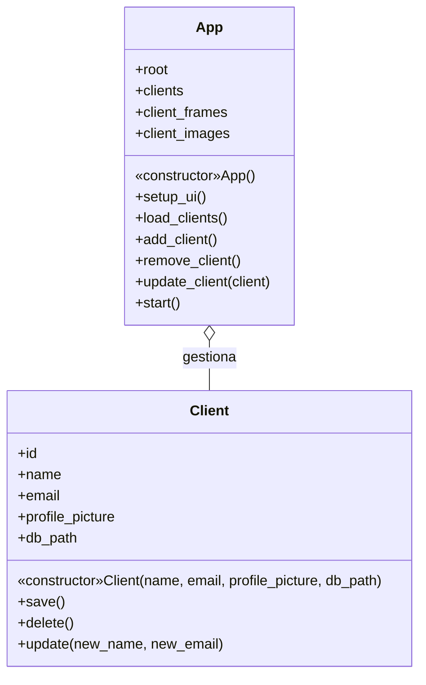
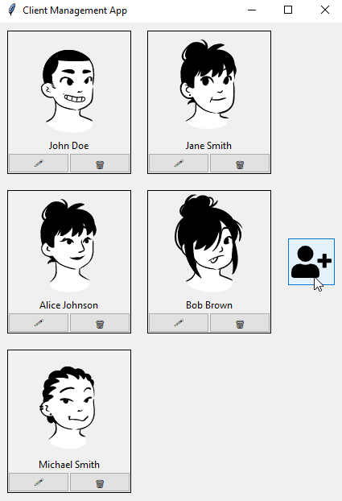

## Actividad #6

### Diagrama de Casos de uso

### Diagrama de Clases

```mermaid
classDiagram
    class Client {
        +id
        +name
        +email
        +profile_picture
        +db_path
        «constructor»Client(name, email, profile_picture, db_path)
        +save()
        +delete()
        +update(new_name, new_email)
    }

    class App {
        +root
        +clients
        +client_frames
        +client_images
        «constructor»App()
        +setup_ui()
        +load_clients()
        +add_client()
        +remove_client()
        +update_client(client)
        +start()
    }

    App o-- Client : gestiona
```

### Solución

[Click para ver código fuente](https://github.com/Kolozuz/oop_unal_202501_act6/)

#### Interfaz del programa

